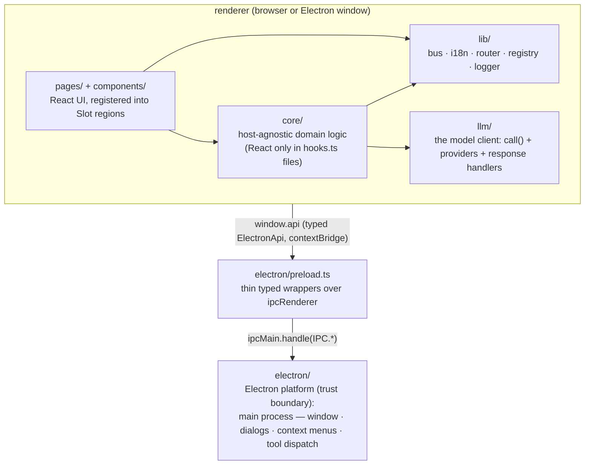

# Architecture

This document is the hub of the v84-harness desktop app's map (`apps/desktop`):
the cross-cutting structure everyone reads first, with per-area deep dives in
[docs/architecture/](architecture/). Portable engineering rules live in
[docs/conventions/](conventions/) (adopted by
[ADR-0010](adr/0010-adopt-shared-conventions.md)); dated decisions and their
trade-offs in [docs/adr/](adr/). The working procedure that maintains all three
layers is the root [/CLAUDE.md](../CLAUDE.md) — agent sessions read it on start.

## Overview

A pnpm-workspace monorepo with two apps:

- **`apps/desktop`** — an Electron + React desktop chat harness that talks to LLM
  providers (OpenAI-compatible, Anthropic, Gemini), runs agent tool calls against
  local workspaces, orchestrates stored agents as parallel sub-agents (ADR-0022),
  and generates media (images/video). **This hub maps `apps/desktop`.**
- **`apps/knowledge`** — the remote backend it talks to when an account is
  connected: per-user durable storage (the per-entity data API behind the remote `StorageRepos`),
  the knowledgebase (`/kb`), and auth. A Hono service on Node + MariaDB + OpenSearch
  + Inngest, with its own area doc ([architecture/knowledge.md](architecture/knowledge.md),
  [ADR-0040](adr/0040-knowledge-remote-service.md) / [ADR-0041](adr/0041-knowledgebase-plane.md)).

The app is **dual-target**: it runs as a pure web app (`pnpm dev`, plain Vite) and as
an Electron app (`pnpm dev:electron`, electron-vite). The renderer is identical in
both; desktop-only capabilities are detected at runtime through a typed bridge
(see [ADR-0001](adr/0001-dual-target-build.md)).

## Process model & layers

The app is **platform hosts over agnostic layers** (ADR-0034): `core/` + `renderer/`
are host-agnostic and depend only on `ctx` (ADR-0032 — config + the llm client + the
storage engine + the platform's tool gateway + host capabilities + the sessions engine);
each platform (`electron/`, `web/`) builds the `ctx` and installs the parts that differ.
The boot is the one place platform is chosen.

Layering rules:

- `core/` never imports from `pages/`, `components/`, `renderer/`, `electron/`,
  `web/`, or Electron. It branches on no platform — it reads `ctx`. React appears
  only in `hooks.ts`/`hooks.tsx` files (thin `useSyncExternalStore` wrappers).
- `electron/` (the Electron platform) uses Node directly and runs the tools in the
  main process (`electron/tools.ts` — workspace tools need `node:fs`, which
  `contextIsolation` blocks in the renderer); it never imports renderer stores.
- The preload (`electron/preload.ts`) only wraps `ipcRenderer.invoke` calls behind the
  `ElectronApi` type.
- Agnostic code (`core/`, `renderer/`, `lib/`) reaches host capabilities only through
  `ctx` — `ctx.api` (the host capability surface, ADR-0036), never the bridge. Only
  `electron/` and `preload/` import the bridge; the boot detects the platform inline
  via `"api" in window`.
- IPC channel names live in one place: the `IPC` const in `electron/bridge.ts`
  ([ADR-0002](adr/0002-typed-ipc-bridge.md)). No string literals at call sites.

## Directory map

| Path | Role |
|------|------|
| `src/electron/` | Electron platform: the IPC contract (`bridge.ts`), the preload (`preload.ts`), the main process (`index.ts` — window, IPC handlers, context menu, save dialogs), the main-side tool dispatch (`tools.ts`), and the local SQLite store (`sqliteStore.ts` in main + the renderer's `sqliteRepos.ts` proxy over IPC) |
| `src/web/` | Web platform: builds the in-process tool registry on `ctx` (the local storage backend is the host-agnostic `core/storage/idb.ts`) |
| `src/renderer/` | Shared, platform-agnostic UI: the `App`, the boot (`main.tsx`), the ctx React bridge (`ctx.tsx` — `useCtx`), the gated-tool catalog hook (`gatedTools.ts`) |
| `src/electron/bridge.ts` | IPC contract: `IPC` channel constants + `ElectronApi` interface (`window.api`) |
| `src/core/` | Host-agnostic domain logic: `ctx` (config + llm + storage engine + tool gateway + host api + sessions engine), config, sessions engine, tools engine (incl. the `account/` memory-tool tier), per-entity `StorageRepos` + `StorageEngine` + `Consumer` base, host capability surface (`host.ts`), containers, approvals, the unified settings registry, agents, the machine-local `account` store (`account.ts` — identity + connection lifecycle), and the plugin system (`plugins/` — manifest registry, `config.plugins` slice, `pluginData` handle, boot scan) |
| `src/llm/` | The model layer (the shared-shape floor): `client.call()` (service-named calls), Provider classes per `<modality>/<type>`, response handlers, and the shapes core/config/tools import down (`Image`/`Video`, `ToolSpec`, `ToolCallRequest`, service unions) |
| `src/lib/` | Renderer utilities: event bus, i18n, router, registry, errors, ui state (the old `store.ts` factory is gone — state is now `core/storage/consumer.ts`) |
| `src/lib/logger/` | `Logger` port (scoped children, structured events) + console / memory sinks |
| `src/core/storage/` | The per-entity `StorageRepos` interface (`types.ts`) + `StorageEngine` (`engine.ts` — holds local + optional remote providers, exposes `repos()` active vs `localRepos()` machine lane), the reactive `Consumer` base (`consumer.ts`), and the providers: `remote.ts` (knowledge-API client), `idb.ts` (IndexedDB), `memory.ts` (tests). The electron local SQLite provider lives in its platform (`electron/sqliteStore.ts` + `sqliteRepos.ts`) |
| `tests/` | Vitest suites for pure logic (path confinement, provider URLs, data-URL parsing) |
| `tests-live/` | Live engine suites against a real LLM endpoint (own config; not part of `pnpm test`) |
| `src/pages/` | Feature UIs; each feature self-registers via `register.tsx` |
| `src/plugins/` | First-party, in-tree plugins (`<slug>/`: manifest, `service.ts`, `tools/`, `ui/`, `locales/`) — a feature as one toggleable folder ([architecture/plugins.md](architecture/plugins.md)) |
| `src/components/` | Reusable presentational components (Modal, Markdown, InlineEdit, …) |
| `src/locales/` | i18n resources (`en.json`, `lt.json`) — must stay key-for-key in parity |

The `lib/` → `core/` migration ([ADR-0003](adr/0003-host-agnostic-core.md)) is
complete, and the state layer moved with it: `lib/store.ts` (the `createStore`
factory) is **deleted** — domain state is now the reactive `Consumer` base in
`core/storage/consumer.ts` ([ADR-0037](adr/0037-reactive-consumer-over-injected-storage.md)),
persisting through `ctx.storage`. Sessions, the unified settings registry
([ADR-0042](adr/0042-unified-settings-registry.md)), agents, and storage all live
in `core/`. What remains in `lib/` is genuinely renderer plumbing (bus, i18n,
router, registry, errors, ui state).

## Area docs

Deep dives, one per subsystem — read the one for the area you're touching
(and point subagents at the specific file):

| Area doc | Covers |
|----------|--------|
| [architecture/state.md](architecture/state.md) | Reactive `Consumer` pattern + hooks; the typed event bus |
| [architecture/sessions.md](architecture/sessions.md) | Sessions engine module shape; the turn loop; sub-agents; media resend window |
| [architecture/tools.md](architecture/tools.md) | Tool system: general / workspace / account tiers; virtual root; caps |
| [architecture/llm.md](architecture/llm.md) | The llm layer: client.call, services, LLMConfig, Provider classes, response handlers, heal |
| [architecture/ui.md](architecture/ui.md) | Contribution registry/regions, routing, agents UX, UI patterns, i18n |
| [architecture/storage.md](architecture/storage.md) | Durable persistence: per-entity `StorageRepos`, the provider swap (`repos()` vs `localRepos()`), tables, shapes, accessor surface |
| [architecture/plugins.md](architecture/plugins.md) | The plugin system: in-tree `<slug>/` folders, the full surface, the service bridge (RPC + events + lifecycle), the MySQL reference plugin |
| [architecture/knowledge.md](architecture/knowledge.md) | The `apps/knowledge` remote service: registry, auth, `/data`, the knowledgebase plane, dev stack |

## Error-handling conventions

- **Unknown throws are normalized** through `errorMessage()` in `lib/errors.ts`;
  the `(e as Error)` cast is banned (conventions/error-handling.md rule 1).
- **Tools**: never throw; return `ToolResult` with `ok: false` and a descriptive,
  actionable `output`.
- **IPC handlers**: never let exceptions cross the IPC boundary; return result
  objects with an `ok`/`error` field (e.g. `MediaModelsResult`) or `null` for
  cancel/failure of save/pick operations.
- **Providers**: transport failures are classified by `withRetry` — transient
  classes (408/429/5xx, dropped connections) retry, but **capacity failures
  (context-length / out-of-memory, even when reported as a 500) are terminal**: the
  prompt is too big, so re-sending it just re-fails and re-bombards the server, and
  the user gets one clear "too large" message instead (conventions/error-handling.md
  rule 7). JSON parse errors on individual SSE frames are skipped silently (frames
  are best-effort); non-streaming HTTP errors must include status *and* response
  body. The client's heal cycle consumes only `HealError`; everything else propagates.
- **Sessions engine** (the turn loop): stream errors become `session:turn:error`
  events appended to the transcript; user Stop (abort) is a clean exit, not an error.

## Conventions

The portable rule set (naming, types placement, consolidation, error handling,
configuration, logging, testing, documentation, model-facing interfaces) lives in
[docs/conventions/](conventions/) and is adopted — with recorded deviations — by
[ADR-0010](adr/0010-adopt-shared-conventions.md). Below are only the
**repo-specific** conventions on top of it.

UI and value-handling rules that started here were promoted into the shared set
([i18n](conventions/i18n.md), [react](conventions/react.md),
[constants-and-identifiers](conventions/constants-and-identifiers.md) —
ADR-0011); they are not restated below.

- **Language / compiler.** TypeScript strict, ESM, Node ≥ 24. Imports always
  include the `.ts`/`.tsx` extension; `import type` for type-only imports;
  `node:` prefix for Node built-ins.
- **Storage namespace.** The app prefix is `v84-harness:` — used for `settings`-row
  keys (one row per `Consumer`, e.g. `v84-harness:ui`) and the handful of
  module-load `localStorage` keys (`v84-harness:account`, `:lang`, `:llm-debug`).
  The per-entity tables (containers/sessions/messages/media/…) are keyed by ULID,
  not by this prefix.
- **Known seed.** `randomSeed()` in `core/tools/helpers/generation.ts` is a
  generation seed, not an id (constants-and-identifiers.md rule 4).
- **Naming (repo-specific).** Files: `camelCase.ts` modules, `PascalCase.tsx`
  components. Tools: a `BaseTool` subclass named for the capability (`ImageGenerate`)
  in `<name>.ts`; the model-facing tool name is PascalCase. A **plugin's** tools prefix
  the model-facing name with the plugin (`MysqlQuery`, not `mysql_query`) — namespacing
  against collisions while staying consistent with core tools. A **plugin** is a folder
  named by its **slug** (`plugins/<slug>/`), lowercase, which is its identity everywhere
  ([architecture/plugins.md](architecture/plugins.md)). LLM providers: the class is always `Provider` in
  `llm/providers/<modality>/<type>.ts` (the path IS the name); abstract bases are
  `Base<Modality>Provider` in each folder's `base.ts`; wire mappers stay
  `stream<Provider>` / `to<Provider>Messages`. A host-agnostic stateful collaborator
  carried on `ctx` is an `<Area>Engine` (`SessionEngine`, `StorageEngine`). Bus events:
  `<domain>:<topic>[:<subtopic>]`. Hooks: `use<Thing>()`, colocated (or `hooks.ts` in
  folder modules). Don't reuse a filename across layers for different concerns
  (`lib/saveMedia.ts` vs `electron/saveDataUrl.ts`).

## Build & distribution

- Web dev: `vite.config.ts` (React, Tailwind v4, `/llm/*` dev proxy).
- Electron dev/build: `electron.vite.config.ts` wraps three Vite builds (main,
  preload as `.mjs` ESM, renderer reusing the web config). `"type": "module"`
  throughout; CJS-only Electron is loaded in preload via `createRequire`.
- Packaging: electron-builder; Windows artifacts are built on a Windows host
  (`pnpm dist:win`), not cross-built from WSL.
- `backgroundThrottling: false` on the BrowserWindow — long renderer work (video
  generation polling) must survive the window being backgrounded.
