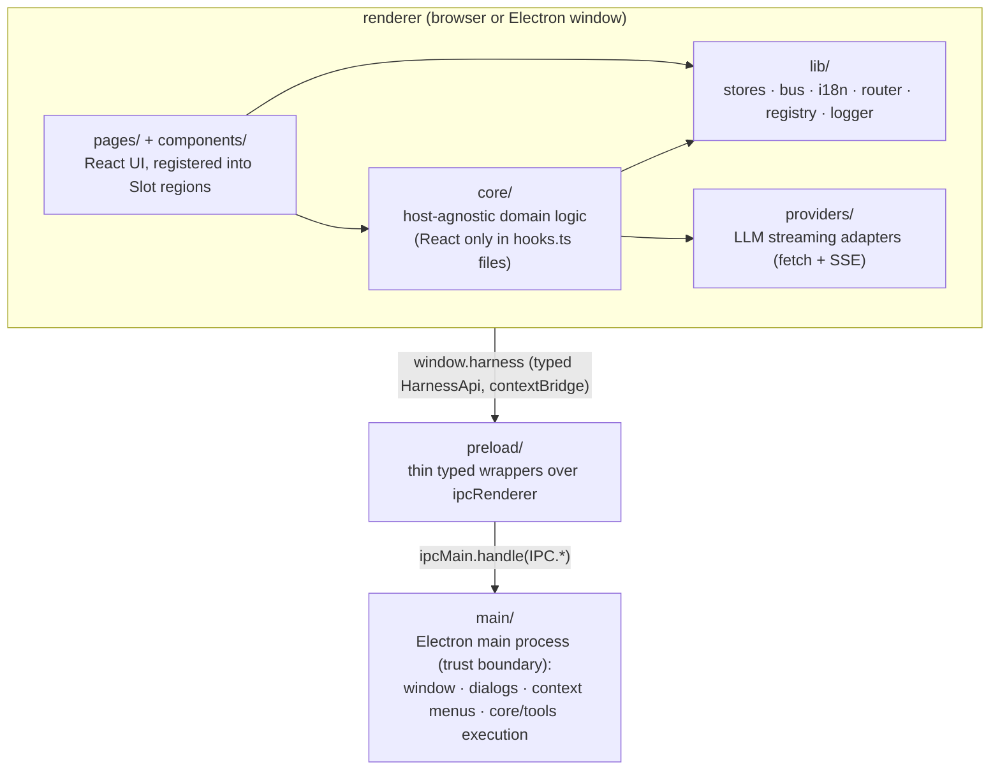

# Architecture

This document is the map of the v84-harness desktop app (`apps/desktop`): structure
as it is and the patterns the codebase commits to. Portable engineering rules live
in [docs/conventions/](conventions/) (adopted by
[ADR-0010](adr/0010-adopt-shared-conventions.md)); dated decisions and their
trade-offs in [docs/adr/](adr/).

## Overview

A pnpm-workspace monorepo with a single app today: an Electron + React desktop chat
harness that talks to LLM providers (OpenAI-compatible, Anthropic, Gemini), runs
agent tool calls against local workspaces, and generates media (images/video).

The app is **dual-target**: it runs as a pure web app (`pnpm dev`, plain Vite) and as
an Electron app (`pnpm dev:electron`, electron-vite). The renderer is identical in
both; desktop-only capabilities are detected at runtime through a typed bridge
(see [ADR-0001](adr/0001-dual-target-build.md)).

## Process model & layers

Layering rules:

- `core/` never imports from `pages/`, `components/`, or Electron. React appears
  only in `hooks.ts` files (thin `useSyncExternalStore` wrappers).
- `main/` uses Node APIs directly and imports from `core/tools` to execute gated
  tools; it never imports renderer stores.
- `preload/` only wraps `ipcRenderer.invoke` calls behind the `HarnessApi` type.
- The renderer reaches the desktop only via `lib/harness.ts` (`harness`,
  `isElectron()`, `requireHarness()`), never `window.harness` directly.
- IPC channel names live in one place: the `IPC` const in `src/bridge.ts`
  ([ADR-0002](adr/0002-typed-ipc-bridge.md)). No string literals at call sites.

## Directory map

| Path | Role |
|------|------|
| `src/main/` | Electron main: window, IPC handlers, context menu, save dialogs |
| `src/preload/` | Context-isolated bridge; exposes `window.harness` |
| `src/bridge.ts` | IPC contract: `IPC` channel constants + `HarnessApi` interface |
| `src/core/` | Host-agnostic domain logic (sessions engine, tools, workspaces, approvals, settings/media/agents stores) |
| `src/providers/` | LLM provider adapters with a unified `StreamEvent` interface |
| `src/lib/` | Renderer utilities: store factory, event bus, i18n, router, registry, errors, ui state |
| `src/lib/logger/` | `Logger` port (scoped children, structured events) + console / memory sinks |
| `src/lib/storage/` | `Storage` port + detected backends: SQLite (bridge) > IndexedDB > localStorage |
| `tests/` | Vitest suites for pure logic (path confinement, provider URLs, data-URL parsing) |
| `src/pages/` | Feature UIs; each feature self-registers via `register.tsx` |
| `src/components/` | Reusable presentational components (Modal, Markdown, InlineEdit, …) |
| `src/locales/` | i18n resources (`en.json`, `lt.json`) — must stay key-for-key in parity |

The `lib/` → `core/` migration ([ADR-0003](adr/0003-host-agnostic-core.md)) is
essentially complete: `sessions` defined the target module shape, and the
config stores (`settings`, `media`, `agents`) followed. What remains in `lib/`
is genuinely renderer plumbing.

## State management

Two building blocks in `lib/store.ts`:

- `createListeners()` — bare subscription registry, for stores with irregular needs.
- `createStore<T>(key, defaults, load?)` — the standard factory: localStorage
  persistence (a `null` key means transient), defaults merge, optional `load()`
  shape-migration hook, `subscribe`/`get`/`set`, and React bindings `use()` /
  `useSelect()` built on `useSyncExternalStore`.

Conventions ([ADR-0004](adr/0004-store-pattern.md)):

- Every store exposes plain getter/mutator functions plus `use*()` hooks.
  Components consume hooks only — never the store object directly.
- Mutations are immutable (spread/copy) and end with `notify()`.
- `core/sessions/store.ts` is the one sanctioned deviation: it uses
  `createListeners()` directly because of its dual-tier persistence
  (localStorage for fast first paint; the durable tier selected by the storage
  port — [ADR-0012](adr/0012-sessions-dual-tier-persistence.md),
  [ADR-0017](adr/0017-storage-port-with-detected-backends.md)). Don't copy that
  shape for ordinary stores.

## Event bus

`lib/bus.ts` is a synchronous typed event bus. Domains declare events by
declaration-merging into `BusEvents` and take a scoped view (`scope("session")`).
Event names are `<domain>:<topic>[:<subtopic>]`, e.g. `session:turn:start`,
`session:tool:calls` ([ADR-0005](adr/0005-event-bus.md)).

The bus decouples the sessions engine from the store: `driver.ts` emits,
`listeners.ts` subscribes and mutates the store, and self-contained services
(`naming.ts`, `compaction.ts`) subscribe independently and run in the background
(`void`-ed promises). Handlers are isolated — one throwing is logged
(`bus handler_crashed`) and never silences the handlers behind it. Every
subscribing module registers HMR cleanup via `import.meta.hot.dispose`; modules
holding live state (the driver's inflight map, the approval queue) also flush it
on dispose.

## Sessions engine (`core/sessions/`)

The reference module shape for `core/` features:

| File | Responsibility |
|------|----------------|
| `store.ts` | State, selectors, mutations, persistence |
| `driver.ts` | Orchestration: the turn loop (`send` → `runTurn`) |
| `events.ts` | Bus event interfaces + declaration merge + scoped bus |
| `listeners.ts` | Bus → store reactions (transcript building, streaming flags, persistence) |
| `hooks.ts` | React bindings only |
| `naming.ts`, `compaction.ts` | Self-contained background services |
| `index.ts` | Barrel export + side-effect imports that wire the services |

Small single-concern modules (`core/approvals.ts`, `core/workspaces.ts`) may stay
single-file **until** they gain side-effect services or listeners — then they split
into the folder shape above ([ADR-0003](adr/0003-host-agnostic-core.md)).

Turn loop highlights (`driver.ts`):

- Per-session `AbortController` map for stop; stopping is not an error. Stop
  also cancels running tools (renderer tools via `ToolCtx.signal`; gated tools
  via the IPC cancel channel) and denies the session's queued approvals —
  see [ADR-0014](adr/0014-stop-semantics-and-tool-cancellation.md) and
  [ADR-0013](adr/0013-approval-promise-bridge.md). Exhausting the step budget
  surfaces as a `turn:error`, never a silent stop.
- Tool loop: advertised tools = always-available renderer tools + workspace-gated
  bridge tools; per-tool permission mode `0 | 1 | 2` (off / ask / auto), with `ask`
  resolved through `core/approvals` (a Promise the ApprovalModal settles). Tools
  whose purpose is putting media in front of the model (LoadImage, LoadVideo) are
  additionally **capability-gated**: withheld from the advertised schemas — and
  refused at run time — when the model doesn't declare the matching input
  ([ADR-0018](adr/0018-capability-gated-media-tools.md)).
- Output validation failures trigger a bounded heal loop (hidden correction turns).
- Tool-produced media (generated or loaded) is fed back as a hidden user turn
  (`mediaFeedback`), filtered to what the model's declared inputs accept.
- The context meter (`usedTokens`) is a **snapshot** of the latest request's
  input + output — never a sum across requests (each request's input already
  counts the whole transcript). Auto-compaction summarizes the session when that
  snapshot crosses the context limit.

## Tool system (`core/tools/`)

([ADR-0007](adr/0007-tool-system.md))

- A tool is one file exporting one const: `export const <name>Tool: Tool =
  { schema, execute }`. Schemas are OpenAI function-tool format; each tool owns its
  schema inline. The contract (`ToolSchema`, `ToolResult`, `ToolCtx`, the tool
  vocabulary and policy constants) lives in `tools/types.ts`; `tools/shared.ts`
  holds only cross-cutting helpers.
- **Gated tools** (Read, List, Grep, Write, Edit, CreateFolder, Bash, LoadImage,
  LoadVideo) run in the Electron main process, dispatched by `execTool()` in
  `tools/index.ts`. They see a **virtual filesystem root**: `/` is the workspace
  root; `paths.ts` maps virtual ↔ real and enforces confinement (including symlink
  escape checks). LoadImage/LoadVideo are a factory-built pair in `loadMedia.ts`
  (one file — they differ only in whitelist, cap, and payload field) and are also
  capability-gated by the model's declared inputs
  ([ADR-0018](adr/0018-capability-gated-media-tools.md)).
- **Permissionless tools** (GenerateImage, GenerateVideo) run in the renderer
  (`tools/renderer.ts`) and work in both web and Electron.
- Tools **never throw**: every path returns `ToolResult { ok, output, … }`.
  The dispatcher catches everything and wraps it.
- Tool output is capped (line/byte limits) before it reaches the model.

## Provider layer (`src/providers/`)

([ADR-0006](adr/0006-provider-abstraction.md))

- One adapter per provider (`openai.ts`, `anthropic.ts`, `gemini.ts`), each an
  `async function* stream<Provider>(cfg, messages, signal, system, tools)` yielding
  the unified `StreamEvent` discriminated union. `streamModel()` in `client.ts` is
  the consumer-facing API and the dispatch point (a switch on `cfg.provider` — the
  switch *is* the registry); `index.ts` is the barrel.
- Shared plumbing lives in `transport.ts` (HTTP + `HttpError` with body text and
  `Retry-After`), `sse.ts` (SSE frame parsing), and `util.ts` (URL/base helpers,
  `safeJson`, response checking). **Adapters must not re-implement these.**
- `withRetry()` wraps every stream: 4xx/abort → terminal `error` event;
  408/429/5xx → `retry` event + exponential backoff + full re-run (consumers reset
  accumulators on `retry`).
- `demuxInlineThink()` post-processes `<think>` tags uniformly for models that
  inline reasoning in text.
- Adapter template: URL helper → message/tool translation (`to<Provider>Messages`)
  → request body → `dlog()` (debug) → `sseRequest()` → parse loop → accumulate tool
  calls → yield events → single usage report.

Cross-adapter conventions (normalized in the pattern-consolidation pass):

- Base URLs are normalized by the shared helper in `util.ts`; a base that already
  contains the provider's path prefix is not double-suffixed.
- Errors from non-streaming calls (model listing) include the response body, via
  the shared response check in `util.ts`.
- Auth credentials are attached only when an API key is actually set.
- Tool-call arguments are accumulated until the provider signals the call is
  complete; emit complete calls only.

## UI layer

- **Contribution registry** ([ADR-0008](adr/0008-ui-registry-routing.md)):
  `lib/registry.ts` defines named regions (`left-top`, `menu`, `right-panel`,
  `settings`, `main`). Each `pages/<feature>/register.tsx` calls `register(...)`;
  `main.tsx` eagerly globs all register files at boot; `<Slot region>` renders
  contributions. Features plug in without touching `App.tsx`.
- **Routing**: minimal hash router (`lib/router.ts`) — `useRoute()` + `navigate()`.
- **Modals**: the shared `components/Modal.tsx` shell for all dialogs. Major
  feature modals are route-driven (Settings); short-lived confirmations use local
  `useState` + `ConfirmActions`.
- **Styling**: Tailwind classes composed with `cn()` (clsx + tailwind-merge).
  Inline `style` only for values computed at runtime (e.g. a percent width).
- **Forms**: settings sections share `pages/settings/Field.tsx` (`Row`, input
  class variants, `DetectButton`).
- **Components stay small**: transcript-rendering pieces (Message, ToolCard,
  Thinking) are standalone files, not nested inside page components.

Recurring UI patterns (codified from review; reuse before reinventing):

- **Registry order** is per-region, lower first, default 0; pick the next free
  integer in that region (`pages/*/register.tsx`).
- **Async probe** (`lib/hooks.ts` `useDetection`): a Detect/Test button wraps a
  probe returning `{ ok, count, error }` plus a format function; the hook owns
  the busy flag and message. Used by Provider and Media sections.
- **Form inputs** use the `pages/settings/Field.tsx` class variants:
  `fieldInput` (fixed-width settings field), `fieldInputFlex` (shares a row
  with a button), `fieldInputFull` (full-width modal forms), `fieldInputBare`
  (compose your own width).
- **Store shape migrations** go through `createStore`'s `load()` hook: try the
  new key, fall back to the legacy key, coerce through a `normalize()` —
  one-time, at creation (see `lib/agents.ts`).

## i18n

([ADR-0009](adr/0009-i18n.md), rules in [conventions/i18n.md](conventions/i18n.md))
i18next + react-i18next; resources in `src/locales/` (`en.json`, `lt.json`);
language persisted under `v84-harness:lang`. The locale pair stays key-for-key —
parity is checked by diffing key sets.

## Error-handling conventions

- **Unknown throws are normalized** through `errorMessage()` in `lib/errors.ts`;
  the `(e as Error)` cast is banned (conventions/error-handling.md rule 1).
- **Tools**: never throw; return `ToolResult` with `ok: false` and a descriptive,
  actionable `output`.
- **IPC handlers**: never let exceptions cross the IPC boundary; return result
  objects with an `ok`/`error` field (e.g. `MediaModelsResult`) or `null` for
  cancel/failure of save/pick operations.
- **Providers**: transport failures are classified by `withRetry`; JSON parse
  errors on individual SSE frames are skipped silently (frames are best-effort);
  non-streaming HTTP errors must include status *and* response body.
- **Driver**: stream errors become `session:turn:error` events appended to the
  transcript; user Stop (abort) is a clean exit, not an error.

## Conventions

The portable rule set (naming, types placement, consolidation, error handling,
configuration, logging, testing, documentation) lives in
[docs/conventions/](conventions/) and is adopted — with recorded deviations — by
[ADR-0010](adr/0010-adopt-shared-conventions.md). Below are only the
**repo-specific** conventions on top of it.

UI and value-handling rules that started here were promoted into the shared set
([i18n](conventions/i18n.md), [react](conventions/react.md),
[constants-and-identifiers](conventions/constants-and-identifiers.md) —
ADR-0011); they are not restated below.

- **Language / compiler.** TypeScript strict, ESM, Node ≥ 24. Imports always
  include the `.ts`/`.tsx` extension; `import type` for type-only imports;
  `node:` prefix for Node built-ins.
- **Storage namespace.** The app prefix is `v84-harness:` (localStorage keys
  `v84-harness:<feature>`); the IndexedDB database is `v84-harness` with a
  `kv` store.
- **Known seed.** `randomSeed()` in `core/tools/media.ts` is a generation seed,
  not an id (constants-and-identifiers.md rule 4).
- **Naming (repo-specific).** Files: `camelCase.ts` modules, `PascalCase.tsx`
  components. Tools: `<name>Tool` const in `<name>.ts`. Provider functions:
  `stream<Provider>`, `list<Provider>Models`, `to<Provider>Messages`. Bus events:
  `<domain>:<topic>[:<subtopic>]`. Hooks: `use<Thing>()`, colocated (or
  `hooks.ts` in folder modules). Don't reuse a filename across `lib/` and `main/`
  for different concerns (`lib/saveMedia.ts` vs `main/saveDataUrl.ts`).

## Build & distribution

- Web dev: `vite.config.ts` (React, Tailwind v4, `/llm/*` dev proxy).
- Electron dev/build: `electron.vite.config.ts` wraps three Vite builds (main,
  preload as `.mjs` ESM, renderer reusing the web config). `"type": "module"`
  throughout; CJS-only Electron is loaded in preload via `createRequire`.
- Packaging: electron-builder; Windows artifacts are built on a Windows host
  (`pnpm dist:win`), not cross-built from WSL.
- `backgroundThrottling: false` on the BrowserWindow — long renderer work (video
  generation polling) must survive the window being backgrounded.
