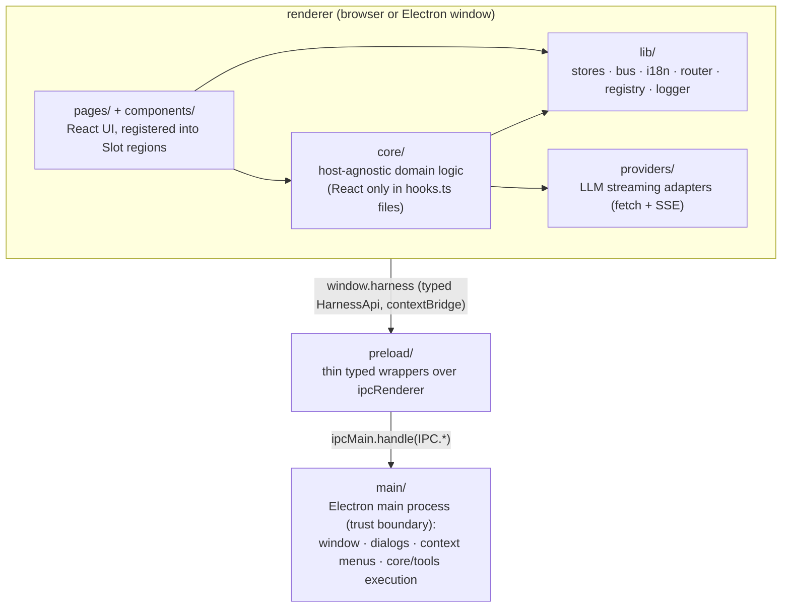

# Architecture

This document is the hub of the v84-harness desktop app's map (`apps/desktop`):
the cross-cutting structure everyone reads first, with per-area deep dives in
[docs/architecture/](architecture/). Portable engineering rules live in
[docs/conventions/](conventions/) (adopted by
[ADR-0010](adr/0010-adopt-shared-conventions.md)); dated decisions and their
trade-offs in [docs/adr/](adr/). The working procedure that maintains all three
layers is the root [/CLAUDE.md](../CLAUDE.md) — agent sessions read it on start.

## Overview

A pnpm-workspace monorepo with a single app today: an Electron + React desktop chat
harness that talks to LLM providers (OpenAI-compatible, Anthropic, Gemini), runs
agent tool calls against local workspaces, orchestrates stored agents as parallel
sub-agents (ADR-0022), and generates media (images/video).

The app is **dual-target**: it runs as a pure web app (`pnpm dev`, plain Vite) and as
an Electron app (`pnpm dev:electron`, electron-vite). The renderer is identical in
both; desktop-only capabilities are detected at runtime through a typed bridge
(see [ADR-0001](adr/0001-dual-target-build.md)).

## Process model & layers

Layering rules:

- `core/` never imports from `pages/`, `components/`, or Electron. React appears
  only in `hooks.ts` files (thin `useSyncExternalStore` wrappers).
- `main/` uses Node APIs directly and imports from `core/tools` to execute gated
  tools; it never imports renderer stores.
- `preload/` only wraps `ipcRenderer.invoke` calls behind the `HarnessApi` type.
- The renderer reaches the desktop only via `lib/harness.ts` (`harness`,
  `isElectron()`, `requireHarness()`), never `window.harness` directly.
- IPC channel names live in one place: the `IPC` const in `src/bridge.ts`
  ([ADR-0002](adr/0002-typed-ipc-bridge.md)). No string literals at call sites.

## Directory map

| Path | Role |
|------|------|
| `src/main/` | Electron main: window, IPC handlers, context menu, save dialogs |
| `src/preload/` | Context-isolated bridge; exposes `window.harness` |
| `src/bridge.ts` | IPC contract: `IPC` channel constants + `HarnessApi` interface |
| `src/core/` | Host-agnostic domain logic (sessions engine, tools, workspaces, approvals, settings/media/agents stores) |
| `src/providers/` | LLM provider adapters with a unified `StreamEvent` interface |
| `src/lib/` | Renderer utilities: store factory, event bus, i18n, router, registry, errors, ui state |
| `src/lib/logger/` | `Logger` port (scoped children, structured events) + console / memory sinks |
| `src/lib/storage/` | `Storage` port + detected backends: SQLite (bridge) > IndexedDB > localStorage |
| `tests/` | Vitest suites for pure logic (path confinement, provider URLs, data-URL parsing) |
| `tests-live/` | Live engine suites against a real LLM endpoint (own config; not part of `pnpm test`) |
| `src/pages/` | Feature UIs; each feature self-registers via `register.tsx` |
| `src/components/` | Reusable presentational components (Modal, Markdown, InlineEdit, …) |
| `src/locales/` | i18n resources (`en.json`, `lt.json`) — must stay key-for-key in parity |

The `lib/` → `core/` migration ([ADR-0003](adr/0003-host-agnostic-core.md)) is
essentially complete: `sessions` defined the target module shape, and the
config stores (`settings`, `media`, `agents`) followed. What remains in `lib/`
is genuinely renderer plumbing.

## Area docs

Deep dives, one per subsystem — read the one for the area you're touching
(and point subagents at the specific file):

| Area doc | Covers |
|----------|--------|
| [architecture/state.md](architecture/state.md) | Store factory + hooks pattern; the typed event bus |
| [architecture/sessions.md](architecture/sessions.md) | Sessions engine module shape; the turn loop; sub-agents; media resend window |
| [architecture/tools.md](architecture/tools.md) | Tool system: gated vs permissionless vs driver-level; virtual root; caps |
| [architecture/providers.md](architecture/providers.md) | Provider adapters, `StreamEvent`, transport/retry conventions |
| [architecture/ui.md](architecture/ui.md) | Contribution registry/regions, routing, agents UX, UI patterns, i18n |
| [architecture/storage.md](architecture/storage.md) | Durable persistence: key scheme, shapes, accessor surface |

## Error-handling conventions

- **Unknown throws are normalized** through `errorMessage()` in `lib/errors.ts`;
  the `(e as Error)` cast is banned (conventions/error-handling.md rule 1).
- **Tools**: never throw; return `ToolResult` with `ok: false` and a descriptive,
  actionable `output`.
- **IPC handlers**: never let exceptions cross the IPC boundary; return result
  objects with an `ok`/`error` field (e.g. `MediaModelsResult`) or `null` for
  cancel/failure of save/pick operations.
- **Providers**: transport failures are classified by `withRetry`; JSON parse
  errors on individual SSE frames are skipped silently (frames are best-effort);
  non-streaming HTTP errors must include status *and* response body.
- **Driver**: stream errors become `session:turn:error` events appended to the
  transcript; user Stop (abort) is a clean exit, not an error.

## Conventions

The portable rule set (naming, types placement, consolidation, error handling,
configuration, logging, testing, documentation, model-facing interfaces) lives in
[docs/conventions/](conventions/) and is adopted — with recorded deviations — by
[ADR-0010](adr/0010-adopt-shared-conventions.md). Below are only the
**repo-specific** conventions on top of it.

UI and value-handling rules that started here were promoted into the shared set
([i18n](conventions/i18n.md), [react](conventions/react.md),
[constants-and-identifiers](conventions/constants-and-identifiers.md) —
ADR-0011); they are not restated below.

- **Language / compiler.** TypeScript strict, ESM, Node ≥ 24. Imports always
  include the `.ts`/`.tsx` extension; `import type` for type-only imports;
  `node:` prefix for Node built-ins.
- **Storage namespace.** The app prefix is `v84-harness:` (localStorage keys
  `v84-harness:<feature>`); the IndexedDB database is `v84-harness` with a
  `kv` store.
- **Known seed.** `randomSeed()` in `core/tools/media.ts` is a generation seed,
  not an id (constants-and-identifiers.md rule 4).
- **Naming (repo-specific).** Files: `camelCase.ts` modules, `PascalCase.tsx`
  components. Tools: `<name>Tool` const in `<name>.ts`. Provider functions:
  `stream<Provider>`, `list<Provider>Models`, `to<Provider>Messages`. Bus events:
  `<domain>:<topic>[:<subtopic>]`. Hooks: `use<Thing>()`, colocated (or
  `hooks.ts` in folder modules). Don't reuse a filename across `lib/` and `main/`
  for different concerns (`lib/saveMedia.ts` vs `main/saveDataUrl.ts`).

## Build & distribution

- Web dev: `vite.config.ts` (React, Tailwind v4, `/llm/*` dev proxy).
- Electron dev/build: `electron.vite.config.ts` wraps three Vite builds (main,
  preload as `.mjs` ESM, renderer reusing the web config). `"type": "module"`
  throughout; CJS-only Electron is loaded in preload via `createRequire`.
- Packaging: electron-builder; Windows artifacts are built on a Windows host
  (`pnpm dist:win`), not cross-built from WSL.
- `backgroundThrottling: false` on the BrowserWindow — long renderer work (video
  generation polling) must survive the window being backgrounded.
