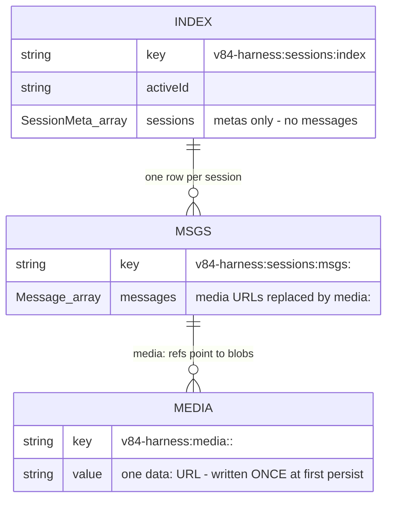
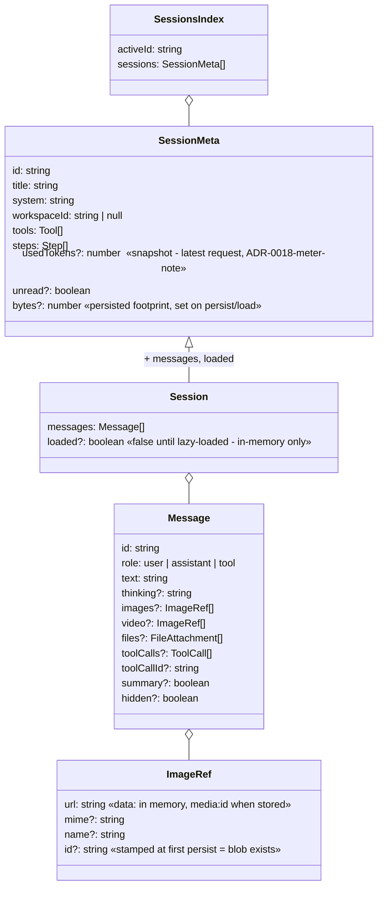
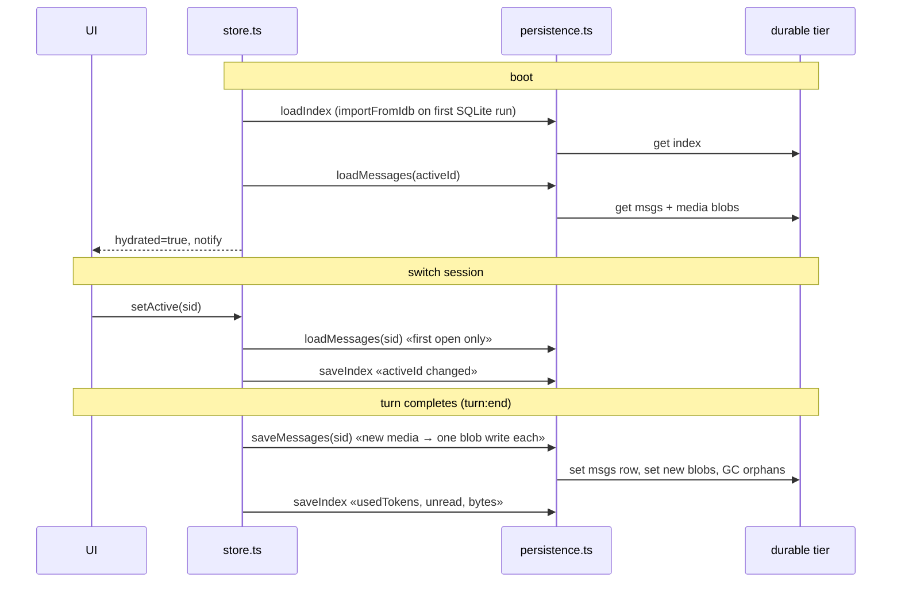

# Storage map — what lives where

The "class diagram" of the sessions state: durable key scheme, in-memory state,
and the accessor surface. Part of the map layer (present tense, updated with the
code). Decisions behind the shapes:
[ADR-0017](adr/0017-storage-port-with-detected-backends.md) (port + detection),
[ADR-0020](adr/0020-persist-at-turn-completion.md) (when writes happen),
[ADR-0021](adr/0021-granular-session-persistence.md) (granular keys).

## Durable tier — key scheme

One detected backend (SQLite > IndexedDB > localStorage) behind the
`Storage { get, set, del, keys }` port. Every key below lives in that one
backend; the prefixes are the "tables":

| Key | Shape | Written when | Read when |
| --- | --- | --- | --- |
| `sessions:index` | `SessionsIndex { activeId, sessions: SessionMeta[] }` | meta changes (create/delete/rename/switch/title) + every `persistSession` | boot |
| `sessions:msgs:<sid>` | `Message[]` (media as `media:<id>` refs) | `turn:end` for the turn's session; compaction replace | boot (active session) + `ensureLoaded` on first open |
| `media:<sid>:<id>` | one `data:` URL | once, when the ref is first persisted (id stamp = already stored) | `loadMessages` reinflation |

GC: `saveMessages` deletes this session's blobs not referenced by any stored
message; `deleteSessionData` removes the msgs row + all `media:<sid>:*`.

## Shapes

`SessionMeta` is exactly `Session` minus `messages`/`loaded` (`toMeta()` in
persistence.ts). `bytes` ≈ stored messages JSON + live media blob lengths.

## In-memory state (`core/sessions/store.ts`, module singletons)

| Variable | Type | Role |
| --- | --- | --- |
| `sessions` | `Session[]` | the profile; untouched message objects keep reference identity (ADR-0019) |
| `activeId` | `string` | selected session |
| `streamingIds` | `Set<string>` | sessions with a live turn (fresh Set per change) |
| `compactingIds` | `Set<string>` | sessions being summarized |
| `hydrated` | `boolean` | durable-tier boot read finished |
| `loading` | `Map<sid, Promise>` | in-flight lazy loads (deduped) |

## Accessor surface

**Selectors** (plain reads — components never call these directly, see hooks):
`getSessions`, `getActive`, `getActiveId`, `getSession(id)`,
`getSessionsForWorkspace`, `getStreamingIds`, `getStreaming`,
`getCompactingIds`, `getCompacting`, `getHydrated`.

**Hooks** (`hooks.ts` — the only state access components use):
`useSessions`, `useActiveId`, `useActiveSession`, `useStreaming`,
`useCompacting`, `useStreamingIds`, `useHydrated`.

**Commands** (user-facing changes; each persists what it touched):
`setActive` (→ `ensureLoaded` + index), `createSession`/`newSession` (index),
`renameSession`/`setTitle` (index), `deleteSession` (rows + blobs + index),
`replaceWithSummary` (session rows, GCs blobs).

**Persistence** (fire-and-forget, failures are logged warnings):
`persistIndex()` — the small index; `persistSession(sid)` — one session's rows
+ blobs + index, refuses unloaded shells; `ensureLoaded(sid)` — lazy load,
shared in-flight.

**Mutators** (called by listeners during a turn; in-memory only — durability
comes from `persistSession` at `turn:end`): `pushTurn`, `appendToLast`,
`setLastToolCalls`, `pushToolResult`, `pushMediaFeedback`, `pushAssistant`,
`pushHeal`, `resetLast`, `setUsage`, `markUnread`, `setStreaming`,
`setCompacting`.

## Lifecycle

Other config stores (`settings`, `media`, `agents`, `workspaces`, ui state) are
small `createStore` instances persisting whole-value to localStorage — they are
NOT part of this scheme and don't need to be (each is a few KB).
