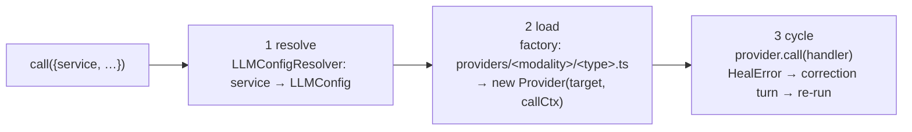

# The LLM layer (`src/llm/`)

Part of the architecture map — start at [../ARCHITECTURE.md](../ARCHITECTURE.md).
([ADR-0028](../adr/0028-llm-client-service-calls.md),
[ADR-0029](../adr/0029-provider-classes-folder-factory.md),
[ADR-0030](../adr/0030-unified-call-target.md); transport rules from
[ADR-0006](../adr/0006-provider-abstraction.md) still apply.)

Everything that talks to a model goes through one entry. A caller names a
**service**, hands the standard message array, and gets back whatever its
**response handler** returns — nobody outside this layer holds connection
details or knows wire formats.

```ts
client.call({ service, messages, system?, tools?, params?, signal?, handler?, maxHeals? })
```

## The vocabulary

| Term | Meaning |
|------|---------|
| **service** | What the caller names: `main` (the chat provider) or a media slot (`imageGen`, `videoGen`, `imageRec`, `videoRec`, `audioGen`, `audioRec`). `SERVICE_MODALITY` maps each to its modality — recognition is a *text* interaction over a vision model; generation is its medium. |
| **LLMConfig** | What a service resolves to — the unified `{provider, model}` shape, owned by config (ADR-0031; formerly `CallTarget`, ADR-0030): `provider: {name, type, baseUrl, apiKey?}` (the configured block; `type` is the matrix key) and `model: {id?, maxTokens?, reasoningEffort?, thinkingBudget?, contextLength?}`. |
| **ProviderKind** | The kind of server a configured provider is: `openai \| anthropic \| gemini \| generate`. One axis for the whole layer — a chat config's "openai" and a media endpoint's "openai" are the same type. The text-only subset is `TextProviderKind` (`openai \| anthropic \| gemini`); the media wire dialect is `MediaApiKind` (`openai \| generate`). |
| **Provider** (runtime) | A class constructed per call with `(target, callCtx)` — `callCtx` is the per-call `CallContext`, NOT the app `Ctx`; one `call(handler)` that owns the whole **request side** — wire and time. |
| **ResponseHandler** | The **response side**: consumes the call result, validates, may side-effect, returns the caller's shape. Throws `HealError` to make the cycle re-prompt. |
| **CallResult** | What a provider hands its handler: `{kind: "chat", events}` (live `StreamEvent` stream) or `{kind: "media", payload}` (`{b64, mime}`). |
| **GenParams** | ONE per-call knob bag. Chat subset (`maxTokens`, `reasoningEffort`, `thinkingBudget`) overlays the resolved model's configured values; media subset (`w/h`, `seed`, `preset`, frames, pacing) feeds the generation wire. Each provider reads the fields its wire knows. |

## One call, three steps



1. **resolve** — `resolver.resolve(service)` through the injected
   `LLMConfigResolver`, the ONE seam to wherever configuration lives. `null` → a
   clean "no model is assigned" error.
2. **load** — the registry IS the folder layout: the service's modality + the
   target's provider type parse straight to a module path
   (`providers/text/openai.ts`, `providers/image/generate.ts`, …), each
   exporting its class as `Provider` (collected by an eager
   `import.meta.glob`). A missing file is the error ("there is no
   text/generate provider" — that's also how *cannot chat* is expressed).
   Adding a provider = dropping a file. The constructor wires the target (with
   the params' chat subset overlaid on the model half) and the call's
   `CallContext` into the instance.
3. **cycle** — the heal loop. `HealError` from the handler carries a
   correction (and optionally the raw failed text → appended as
   assistant + correction turns to the live `callCtx.messages`); the provider is
   re-run until valid or the budget (`maxHeals` → client default → 3) is
   spent. Anything else propagates untouched.

The `LLMClient` interface is two methods — `call` and `resolve(service):
LLMConfig | null` (the latter for tools' canRun/slot checks, so they depend only
on the client). Other config questions ("what are the model's params?") are asked
config-side (stores / `ctx.config`), never through the client.

## Providers own the request side — wire AND time

```
providers/
  base.ts          BaseProvider: ctor(target, callCtx) + init() hook (no ctor overriding),
                   protected request() (auth/base/status, signal from callCtx), prompt()
  text/base.ts     BaseTextProvider: withRetry + inline-<think> demux → hands the
                   handler the LIVE event stream; subclasses map the wire (stream())
  text/openai.ts   class Provider — also `static listModels()` (the /models catalog)
  text/anthropic.ts, text/gemini.ts
  image/base.ts    BaseImageProvider: prompt → generate() → payload; inlineUrl()
  image/openai.ts  /images/generations  ·  image/generate.ts  bare POST /generate
  video/base.ts    BaseVideoProvider OWNS TIME: submit → poll loop → download
  video/openai.ts  the three wire verbs of the jobs flow
```

- Providers are constructed per call; config lives in the instance. Nothing
  routes after load.
- The text catalogs are `static listModels()` on each text Provider class —
  config-side lookup goes through `listProviderModels(provider)` (same folder
  factory); a type with no catalog (bare `/generate`) lists nothing by
  absence.
- Transport rules are unchanged from ADR-0006: `transport.ts`
  (`sseRequest` + `withRetry`: 408/429/5xx → `retry` event + full re-run,
  consumers reset accumulators), `sse.ts`, `util.ts`. Media providers use the
  base's `request()` instead (no SSE).

## Response handlers (`responseHandlers/`)

Pure consumers/validators — the standard kit:

| Handler | Consumes | Returns |
|---------|----------|---------|
| `textHandler` | chat events (via shared `bufferEvents`) | trimmed text |
| `bufferedTextHandler` | chat events | `ChatOutcome` (text + thinking size + usage) — naming/compaction meter tokens with it |
| `jsonHandler(validate)` | chat events | `T` — a validator throw becomes `HealError(message, raw)` |
| `imageHandler` / `videoHandler` | media payload | `{b64, mime}` (typed doors; wrong interaction kind → clear error) |

Callers bring their own for special shapes: the session driver's
`chatStepHandler` streams deltas/thinking/usage onto the session bus *as they
arrive* and returns `{text, thinking, calls}` — tool calls are not special to
this layer; the driver's loop acts on them (execution, approvals, feedback
stay driver-side).

## Where configuration lives

The llm layer never reads stores or config — `createClient(resolver, defaults?)`
is handed an `LLMConfigResolver` (`{ resolve(service): LLMConfig | null }`) and
resolves through it. The app's `ctx` is that resolver (ADR-0032): `ctx.resolve`
reads `config.llm[service]`. Config is the sole source of truth (ADR-0031); the
resolved entry is `LLMConfig` (the former `CallTarget`, now owned by config), and
the stores already hold that shape (no seam translations). `config.llm` itself is
now **derived** — the unified Settings registry (providers → models → per-service
assignments) re-resolves every service to an `LLMConfig` and writes the
`config.llm` slice on each change, so `main` and the media services come from one
place ([ADR-0042](../adr/0042-unified-settings-registry.md)):

- **renderer** (`web/init.ts` / `electron/init.ts`): the singleton
  `ctx = new Ctx(new StorageEngine(...))`; the `Ctx` constructor (`core/ctx.ts`)
  takes a `StorageEngine`, reads config via `getConfig()` internally, and builds
  its one client with `createClient(this, …)` (the ctx is the resolver). The
  `maxHeals` default reads app config per call.
- **main process**: builds NO `Ctx`. `electron/tools.ts` holds a standalone
  `createClient(resolver, …)` whose resolver reads a module-level `config`
  re-seeded per call from the bridge's `WireConfig { config }` (cwd now rides on
  each `ToolCallRequest`, not the wire). The client and signal are process-local —
  neither crosses IPC.
- **tests**: `new Ctx(...)` takes a `StorageEngine`, not a config object.

## Heal, in two places by design

The client's cycle heals *ephemeral* calls (its private messages copy —
upsampling, JSON validation). The session driver heals *persisted*
conversations itself (corrections become session turns via the bus, because
the bad text already streamed to the UI/store). Same concept, two storages —
kept separate deliberately.
