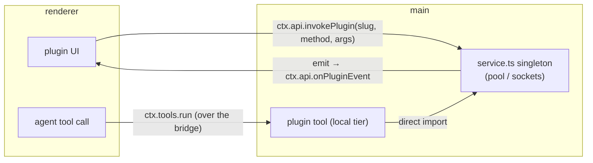

# Plugin system

Part of the architecture map — start at [../ARCHITECTURE.md](../ARCHITECTURE.md). Decisions behind
the shape: [ADR-0047](../adr/0047-first-party-in-tree-plugins.md) (the plugin model),
[ADR-0048](../adr/0048-tool-ctx-config-carrier.md) (tools take a config carrier),
[ADR-0049](../adr/0049-plugin-service-bridge.md) (the service bridge: RPC + events + lifecycle).

A **plugin** is a first-party, in-tree folder that bundles a feature's tools, UI, stateful service,
config, and i18n behind one enable toggle. Plugins are **not** runtime-loaded or sandboxed — the code
is ours, compiled into the build. They exist so a self-contained capability (a database client, an
integration) can be added as one folder that plugs into the existing registries without touching
`App.tsx` or core wiring, and removed by deleting the folder.

**Positioning.** Plugins target the **Electron build**. The web app is the default for general users;
plugins are a power/developer feature — a dev drops a plugin folder and compiles their own Electron
app. Web parity is a non-goal: Node-backed services and `local`/`remote`-tier tools are desktop-only.
On web a plugin still gets its config, UI, `general`/`account` tools, and `pluginData` (so e.g. a
connection list is still manageable there), just not the parts that need the Node main process.

## Folder layout

```
apps/desktop/src/plugins/<slug>/
  manifest.ts        # slug, name, version, default-enabled, settings schema + defaults + validateSettings
  service.ts         # main-side stateful singleton: rpc + events + install/uninstall (optional)
  tools/
    <tier>/          # BaseTool subclasses in the existing tiers (general / local / account / remote)
    helpers/         # non-tool helpers (never globbed as tools)
  ui/
    register.tsx     # registers Slot contributions, each tagged with pluginId
    *.tsx            # settings section + side-rail blocks
  locales/
    en.json, lt.json # merged into i18next under translation.plugins.<slug>
```

The **slug** (folder name) is the plugin's identity everywhere: `ownerPluginId` on its tools, `pluginId`
on its UI contributions, `plugin_id` on its `plugin_data` rows, and the key under `config.plugins.<slug>`.
There is no minted id and no installed-registration row.

## The surface (what a plugin can contribute)

| Capability | Mechanism | Where |
| --- | --- | --- |
| Settings + enable flag | `config.plugins.<slug>` — a synced settings row, validated by the manifest | `core/plugins/config.ts` |
| Agent tools | `tools/<tier>/` — `BaseTool` subclasses, globbed into the registry of the process the tier runs in | [tools.md](tools.md) |
| Stateful runtime | `service.ts` — a main-process singleton (e.g. a connection pool) | per plugin |
| UI → service (call) | the service's `rpc` record, invoked via `ctx.api.invokePlugin` | [ADR-0049](../adr/0049-plugin-service-bridge.md) |
| service → UI (push) | the service's `subscribe(emit)`, forwarded to `ctx.api.onPluginEvent` | [ADR-0049](../adr/0049-plugin-service-bridge.md) |
| enable/disable lifecycle | the service's `install` / `uninstall` hooks | [ADR-0049](../adr/0049-plugin-service-bridge.md) |
| UI surfaces | Slot contributions (settings section + `left-top` / `right-panel`), tagged `pluginId` | [ui.md](ui.md) |
| Persistent data | `pluginData(slug).collection(name)` — slug-namespaced, reactive | `core/plugins/data.ts` |
| i18n | `locales/` merged under `translation.plugins.<slug>`; read as `t("plugins.<slug>.<key>")` | `lib/i18n.ts` |

## Registered at boot, gated at runtime

Plugins are **all** registered from boot — manifests, tools, UI contributions, locales are globbed
eagerly. "Enabled" is a pure **runtime filter**, never a glob-time or registration-time decision:

- **Manifests** — `core/plugins/boot.ts registerPluginManifests()` globs `plugins/*/manifest.ts` and
  registers each. `config.plugins.<slug>` derives its entries from the registered manifests.
- **Tools** — globbed into the per-process registries by tier alongside core tools (`web/init.ts` adds
  `general`/`account`; `electron/tools.ts` main adds `general`/`local`; `electron/init.ts` renderer adds
  `account`). The registry tags each tool's `ownerPluginId` from its glob path and **drops a disabled
  plugin's tools** in `filter()`/`run()` ([tools.md](tools.md)).
- **UI** — `renderer/main.tsx` globs `plugins/*/ui/register.{ts,tsx}`. `<Slot>` drops a contribution
  whose `pluginId` is disabled; `SettingsModal` does the same for the settings menu ([ui.md](ui.md)).
- **Locales** — `lib/i18n.ts` merges `plugins/*/locales/*.json` under `translation.plugins.<slug>`.

The "Plugins" settings section (`pages/settings/PluginsSection.tsx`) is the master enable/disable list;
an enabled plugin's own settings appear as **their own settings-menu section** (registered into the
`settings` region, gated by enabled).

## The service — main-side state, three channels

A plugin's stateful, long-lived resources (a DB connection pool, a socket) live in `service.ts`, a
**module-level singleton in the main process** (where the plugin's `local`-tier tools run, so the tools
and the service share the same instance). The service is reached three ways, all through the bridge:



- **RPC (UI → service):** the service exports an `rpc` record; the UI calls `ctx.api.invokePlugin(slug,
  method, args)` → `IPC.pluginInvoke` → `electron/pluginServices.ts` dispatches to `rpc[method]`. This is
  for operations that are **not** agent tools (e.g. a connect/disconnect button).
- **Events (service → UI):** the service exports `subscribe(emit)`; the host (`electron/index.ts`)
  subscribes and forwards each emit to the renderer over `IPC.pluginEvent`, surfaced as
  `ctx.api.onPluginEvent`. Because the service is the singleton, this reflects **every** state change —
  including a resource opened by an agent tool's auto-connect, not just UI actions.
- **Lifecycle:** the service may export `install()` / `uninstall()`. `install` runs when the plugin is
  enabled and at boot for already-enabled plugins (`installEnabledPlugins`); `uninstall` runs on disable.
  Dispatched over the same `invokePlugin` channel as reserved phases — no separate channel.

`ctx.api.invokePlugin` / `onPluginEvent` are part of the host capability surface ([ADR-0036](../adr/0036-host-capability-surface.md));
they are **absent on web**, so the renderer helper (`core/plugins/service.ts`) degrades to a clean
"desktop only" result and the UI still renders.

### Tools stay thin; the service owns state

A plugin's tools never hold long-lived state and **never persist data directly**. Main-side state —
live (a pool) or, if ever needed, durable — belongs to the service singleton. `pluginData` is the
renderer/UI store. This keeps writes deliberate and centralized rather than scattered across stateless
tool invocations, and matches the tool contract (a tool is constructed once and runs per call).

## State model (where each thing lives)

| Thing | Home | Realm |
| --- | --- | --- |
| Enable flag + settings (incl. secrets the user chooses to save) | `config.plugins.<slug>` (settings row) | synced — follows the connection ([ADR-0045](../adr/0045-machine-local-vs-account-synced.md)) |
| Runtime data (collections of rows) | `plugin_data` table, `(pluginId, collection, key)` | synced like every entity |
| Live resources (pools, sockets) | the `service.ts` singleton | ephemeral main-process state, gone on quit |

There is **no `plugins` table** — first-party plugins have no installed-registration row; config owns
enable + settings and the manifest owns identity + version ([ADR-0047](../adr/0047-first-party-in-tree-plugins.md)).

## Reference plugin — Database (`plugins/database/`)

Exercises the whole surface: connect to SQL servers and run queries. **Two engines, one plugin** —
MySQL and Postgres — with the engine carried on each connection, not split into separate plugins (see
[conventions/pluggable-backends.md](../conventions/pluggable-backends.md)).

- **manifest** — slug `database`; settings are named connections `{ name, engine, host, port, user,
  password?, database?, ssl? }` (`engine` is `"mysql" | "postgres"`, password optional), validated on
  store — `engine` defaults to `mysql`, `port` to that engine's default. Declares a `systemPrompt` — the
  worked example of a plugin **capability block** (see below). Renderer-bundled, so it imports **no DB
  driver** — per-engine default ports live as plain data in `types.ts`.
- **drivers** (`drivers/`) — one adapter per engine behind a neutral interface. `DbDriver.open()` creates
  a pool that an `OpenConn` exposes as `query` / `probe` / `end`; `mysql.ts` wraps `mysql2`, `postgres.ts`
  wraps `pg`, each mapping its native result onto a neutral `QueryResult` so the rest of the plugin never
  branches on engine. `drivers/index.ts` is the `engine → driver` map (adding an engine = new file + one
  entry + one union member). SSL on → lenient TLS (accepts self-signed).
- **service** — connection pools keyed by name (engine-agnostic `OpenConn` handles; the driver owns the
  native pool, so this file imports no DB library). One `resolve()` reuses the live pool or establishes +
  validates a new one via `drivers[engine]` (so every failure surfaces with its message: missing password,
  server unreachable, access denied), and tears a failed pool down. `rpc` = `connect` / `disconnect` /
  `status`; `subscribe` emits the live connection names on every change; `uninstall` disconnects all pools.
- **agent tools** (`tools/local/`, `needsWorkspace()=false`): `DatabaseConnections` (list configured
  connections — discovery, reports each connection's **engine** so the model writes the right dialect),
  `DatabaseQuery` (run any SQL, **permissioned → ask**, results row-capped at 50), `DatabaseTestConnection`
  (liveness check). Read/write is **not** split — classifying SQL gives no real safety; the boundary is the
  connecting DB user's privileges plus the per-query approval.
- **UI** — a settings-menu section (collapsible connection cards with an engine dropdown + SSL toggle + a
  Test probe) and a right-rail connections card with connect/disconnect, an engine label per row, and an
  inline password prompt when a connection has no saved password. The card subscribes to service events, so
  an agent query's auto-connect flips the status dot live. (Contributes to `settings` + `right-panel`
  regions only — no left-rail block.)
- **helpers** — `tools/helpers/format.ts` (engine-neutral row formatter), kept out of the tier folders.
- **system prompt** — `manifest.systemPrompt` teaches the model the Database tools (discover via
  `DatabaseConnections`, write SQL in the connection's engine dialect, `LIMIT` your queries, the
  privilege/approval safety boundary). It's a **capability block**: `enabledPluginPrompts()` collects it
  and the turn loop appends it to the system prompt **while the plugin is enabled** — the same shape as the
  built-in browser/memory blocks ([ADR-0052](../adr/0052-system-prompt-layering.md)).

Tool names are **PascalCase, prefixed by the plugin** (`DatabaseQuery`, not `database_query`) — consistent
with core tools and namespaced against collisions.

## Writing a new plugin

1. Create `plugins/<slug>/manifest.ts` exporting a `PluginManifest` (slug, name, version, settings
   defaults + `validateSettings`; an optional `systemPrompt` to teach the model its tools). It appears in
   Settings → Plugins, disabled by default.
2. Add tools under `tools/<tier>/` — `BaseTool` subclasses; pick the tier by the process + permission it
   needs (Node/fs → `local`, permissionless/HTTP → `general`, account token → `account`). Read config
   via `this.config().plugins.<slug>`. Non-tool helpers go in `tools/helpers/`.
3. If the plugin has stateful/long-lived resources, add `service.ts` with `rpc` (UI ops), `subscribe`
   (events), and `install`/`uninstall` (lifecycle) as needed.
4. Add `ui/register.tsx` — register a `settings`-region contribution for its settings block (tagged
   `pluginId`) and any side-rail blocks. UI calls the service via `invokePluginService(ctx, slug, …)`.
5. Add `locales/en.json` + `lt.json` (key-for-key); read strings as `t("plugins.<slug>.<key>")`.
6. Persist UI-owned data through `pluginData(slug).collection(name)`.

Everything is picked up at the next boot; no central registration to edit.
