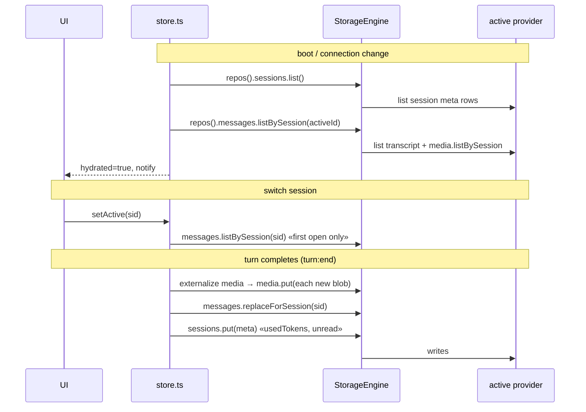

# Storage map — what lives where

The "class diagram" of the durable model: the per-entity repository layer, the
provider swap, the session in-memory state, and the accessor surface. Part of the
map layer (present tense, updated with the code). Decisions behind the shapes:
[ADR-0043](../adr/0043-per-entity-repos.md) (per-entity tables + `StorageRepos`),
[ADR-0044](../adr/0044-storage-engine-provider-swap.md) (the `StorageEngine`
provider swap + the machine-local lane),
[ADR-0045](../adr/0045-machine-local-vs-account-synced.md) (machine-local vs
account-synced state), [ADR-0020](../adr/0020-persist-at-turn-completion.md)
(when message writes happen). Supersedes the KV `Storage` port + `StorageEngine`
over string blobs ([ADR-0035](../adr/0035-storage-engine.md)), the
`sessions:index` / granular-key scheme
([ADR-0021](../adr/0021-granular-session-persistence.md)), and the
local-baseline-plus-remote swap on a single key namespace
([ADR-0038](../adr/0038-storage-backend-swappable-at-runtime.md)) — all gone.

## Backends — four implementations of one `StorageRepos`

Every backend implements the same `StorageRepos` (`core/storage/types.ts`): a
typed repository per entity, not a generic key/value port. Each platform `init()`
builds the engine with a **local** backend, and adds a **remote** one when the
account is connected:

| Backend | File | Used by | Storage |
| --- | --- | --- | --- |
| Remote API client | `core/storage/remote.ts` | both hosts, when connected | the knowledge API's typed endpoints (`/containers`, `/sessions`, `/messages`, `/media`, …) over `authedFetch` ([knowledge.md](knowledge.md)) |
| Electron SQLite | `electron/sqliteRepos.ts` (renderer proxy) → `electron/sqliteStore.ts` (main) | electron, offline | main-process `node:sqlite`, one table per entity, called over IPC (`window.api.storage.exec`) |
| IndexedDB | `core/storage/idb.ts` | web offline; electron offline when `node:sqlite` can't open | one object-store per entity in the renderer |
| In-memory | `core/storage/memory.ts` | unit tests / storage-less hosts | `Map`s, no persistence |

The electron local backend is chosen by a capability probe:
`init()` uses `sqliteRepos()` when `api.storage.available()` (the main process
opened `data.db`), else falls back to `idbRepos()` — the renderer code is
identical, only the transport differs. `sqliteStore.ts` loads `node:sqlite`
fail-soft; if it's unavailable `available` is `false` and the renderer takes the
IDB path.

## `StorageEngine` — two lanes over the active provider

`ctx.storage` is a `StorageEngine` (`core/storage/engine.ts`) holding the local
backend and an optional remote one. It exposes two lanes:

- **`repos()`** — the **active** provider, `remote ?? local`. CONTENT
  (containers, sessions, messages, media) reads/writes here, so it **follows the
  connection**: connected → the cloud, offline → the device.
- **`localRepos()`** — **always** the local provider. MACHINE state (settings,
  ui, agents, config — see [state.md](state.md)) reads/writes here, so it stays
  on the device and does not swap to the (initially empty) remote on connect.

`connect(remote)` / `disconnect()` flip the active provider; `connected` reports
whether a remote is attached. The swap is a **swap, not a merge** — the two
realms are independent and nothing migrates. An empty remote shows an empty
profile; logging out shows the device's local profile again. `core/account.ts`
(`applyConnection`) calls `connect`/`disconnect` on login/logout/toggle and then
re-hydrates every store from the now-active provider — no reload
([ADR-0044](../adr/0044-storage-engine-provider-swap.md),
[state.md](state.md)).

## Tables — one row per entity, no master index

`StorageRepos` is the whole model on one structure; every backend lays it out as
per-entity tables/stores:

| Repo | Row type | Keyed by | Notes |
| --- | --- | --- | --- |
| `containers` | `Container` | `id` | CRUD |
| `sessions` | `SessionMeta` | `id` | CRUD; the rows ARE the session list — no index blob |
| `messages` | `Message` (transcript) | `sessionId` | `listBySession` / `replaceForSession` (whole-transcript replace) |
| `media` | `MediaRow` | `id` (indexed by `sessionId`) | externalized blobs |
| `agents` | `Agent` | `id` | CRUD |
| `settings` | `SettingRow` | `key` | one row per consumer key; `scope` = `account` \| `local` |
| `plugins` | `PluginRow` | `id` | CRUD |
| `plugin_data` | `PluginDataRow` | `(pluginId, collection, key)` | per-plugin collections |

Ids are **ULIDs** (`core/ids.ts`) — sortable by creation time, client-generated,
stable across a row moving local↔remote so foreign keys (`containerId`,
`sessionId`) never break. The repo interfaces are uniform: `CrudRepo<T>` for the
id-keyed entities, `MessageRepo`/`MediaRepo`/`SettingRepo`/`PluginDataRepo` for
the ones with a different access shape.

The session list is enumerated from the `sessions` meta rows — there is no
`sessions:index` and no whole-list blob, so a per-row write cannot clobber the
set (the data-loss bug the old index blob caused).

### Delete — hard local, soft remote

`remove()` means "gone" to the caller in both realms, but the realms differ:

- **Local** hard-deletes the row. Offline `deleteSession` also clears the
  transcript (`messages.replaceForSession(id, [])`); recovery is the remote
  realm's concern.
- **Remote** issues a `DELETE`; the server **soft-deletes** (stamps `deleted_at`)
  and filters it out of reads, keeping messages for restore. The client just
  calls `remove()` and never sees the retained copy.

## Media — externalized, reinflated on open

Media never rides inside a message row. On persist, `externalizeMedia`
(`core/sessions/store.ts`) walks each message's `images`/`videos`, and for every
item still carrying a `data:` URL writes a `MediaRow` to the `media` repo (keyed
by `sessionId`, stamping the in-memory item with a ULID `id` so a re-persist
reuses the same row) and swaps the item's `url` for a `media:<id>` reference.
Stored message rows therefore hold only refs. On open, `inflateMedia` reads
`media.listBySession(sid)` once and swaps each `media:<id>` ref back to its
`data:` URL. Items already on `http(s)` (or already a ref) pass through
untouched.

## Shapes

```mermaid
classDiagram
    class Session {
        id: string
        title: string
        system: string
        containerId: string  «never null»
        agentId?: string
        parentId?: string
        tools: SessionTool[]
        usedTokens?: number  «snapshot - latest request»
        unread?: boolean
        bytes?: number
        messages: Message[]
        loaded?: boolean  «false until lazy-loaded - in-memory only»
    }
    class Message {
        id: string
        role: user | assistant | tool
        text: string
        thinking?: string
        images?: Image[]
        videos?: Video[]
        files?: FileAttachment[]
        toolCalls?: ToolCallRequest[]
        toolCallId?: string
        childSessionIds?: string[]
        summary?: boolean
        hidden?: boolean
        createdAt?: number
    }
    class Image {
        url: string  «data: in memory, media:id when stored»
        mime?: string
        name?: string
        id?: string  «stamped at first persist = media row exists»
    }
    class Video {
        url: string  «data: in memory, media:id when stored»
        mime?: string
        name?: string
        id?: string  «stamped at first persist = media row exists»
    }
    class MediaRow {
        id: string
        sessionId: string
        messageId: string
        kind: image | video | file
        mime: string
        name: string | null
        data: string  «the data: URL»
    }
    Session o-- Message
    Message o-- Image
    Message o-- Video
    MediaRow ..> Image : «media:id ref»
    MediaRow ..> Video : «media:id ref»
```

`SessionMeta` is exactly `Session` minus `messages`/`loaded` (`toMeta()` in
`sessions/persistence.ts`) — it's the `sessions` table row; the transcript lives
in the `messages` table. `Image` and `Video` (`llm/types.ts`) are distinct types,
identical today, kept apart so the medium lives in the type, not a field
convention, and is free to diverge (dimensions, duration). The containing field
(`images` / `videos`, both **arrays**) agrees with the type; both carry
`media:<id>` refs once externalized.

## In-memory state (`core/sessions/store.ts`, module singletons)

| Variable | Type | Role |
| --- | --- | --- |
| `sessions` | `Session[]` | the profile; untouched message objects keep reference identity ([ADR-0019](../adr/0019-reference-stable-transcript.md)) |
| `activeId` | `string` | selected session |
| `streamingIds` | `Set<string>` | sessions with a live turn (fresh Set per change) |
| `compactingIds` | `Set<string>` | sessions being summarized |
| `hydrated` | `boolean` | first hydrate finished |
| `loading` | `Map<sid, Promise>` | in-flight lazy loads (deduped) |
| `childRuns` | `Record<id, sid[]>` | live RunAgent links — transient by design |

## Accessor surface

**Selectors** (plain reads — components use hooks, not these):
`getSessions`, `getActive`, `getActiveId`, `getSession(id)`,
`getSessionsForContainer`, `getStreamingIds`, `getStreaming`,
`getCompactingIds`, `getCompacting`, `getHydrated`, `getChildRuns`.

**Hooks** (`hooks.ts` — the only state access components use):
`useSessions`, `useActiveId`, `useActiveSession`, `useStreaming`,
`useCompacting`, `useStreamingIds`, `useHydrated`.

**Commands** (user-facing changes; each persists what it touched):
`setActive` (→ `ensureLoaded` + meta when the unread flag clears),
`createSession`/`newSession` (meta row), `renameSession`/`setTitle`/`unlinkAgent`
(meta row), `deleteSession` (row remove, provider-aware), `replaceWithSummary`
(rewrites the transcript, GCs orphaned media via re-externalize).

**Persistence** (fire-and-forget, failures are logged warnings; the durable
reads/writes go through `ctx.storage.repos()`):

- `persistSessionMeta(sid)` — one `sessions` row, routed by `repos()`. Gated on
  `hydrated` + a real `containerId` so the pre-hydration placeholder never reaches
  a backend.
- `persistSession(sid)` — externalizes media into the `media` repo, then
  `messages.replaceForSession`, then the meta row. Refuses an unloaded shell or
  the placeholder so it never clobbers stored rows.
- `ensureLoaded(sid)` — lazy load: `messages.listBySession` + `inflateMedia`,
  shared in-flight so a double open reads once.
- `hydrate()` — `sessions.list()` from the active provider (no master index);
  loads the active session's transcript for first paint, the rest lazy-load. On
  an empty profile binds one starter session to the active container.

The engine is injected via `useStorage(...)` in each `init()`, which also drives
the hydrate order (containers → agents → sessions, so a session's container
exists). Persistence is a no-op until injection.

**Mutators** (called by listeners during a turn; in-memory only — durability
comes from `persistSession` at `turn:end`, [ADR-0020](../adr/0020-persist-at-turn-completion.md)):
`pushTurn`, `appendToLast`, `setLastToolCalls`, `pushToolResult`,
`pushMediaFeedback`, `pushAssistant`, `pushHeal`, `pushContext`, `resetLast`,
`setUsage`, `markUnread`, `addChildRun`, `setStreaming`, `setCompacting`.

## Lifecycle



On a connection change `account.ts` swaps the provider behind `repos()` and
re-runs the same hydrate, so the identical calls now resolve against the other
realm. The other domains (`settings`, `agents`, `containers`, app config, ui
state) hydrate alongside — entity stores through `repos()`/`localRepos()`,
Consumers through the `settings` table; their split (synced vs machine-local) is
charted in [state.md](state.md). `core/account.ts` itself is not in any backend —
it's `localStorage`, read before the provider is even chosen
([state.md](state.md), [ADR-0045](../adr/0045-machine-local-vs-account-synced.md)).
