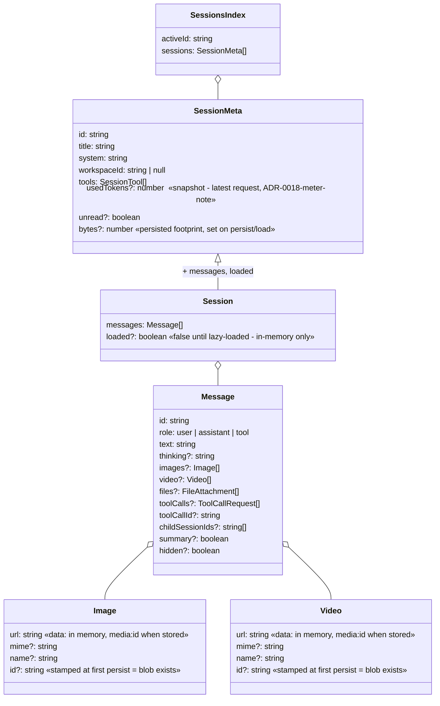
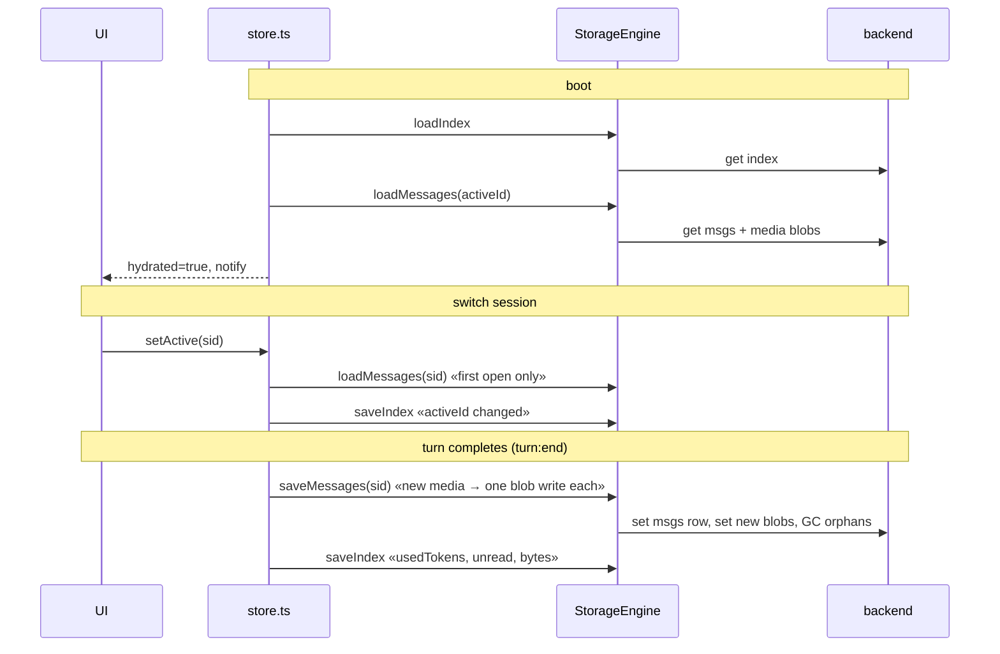

# Storage map — what lives where

The "class diagram" of the sessions state: durable key scheme, in-memory state,
and the accessor surface. Part of the map layer (present tense, updated with the
code). Decisions behind the shapes:
[ADR-0035](../adr/0035-storage-engine.md) (the `StorageEngine` + `Storage` port),
[ADR-0038](../adr/0038-storage-backend-swappable-at-runtime.md) (local baseline +
remote, swapped at runtime), [ADR-0020](../adr/0020-persist-at-turn-completion.md)
(when writes happen), [ADR-0021](../adr/0021-granular-session-persistence.md)
(granular keys).

## Backends — local baseline + remote, swappable

The `StorageEngine` (`core/storage/engine.ts`) holds a **local baseline** and an
**optional remote** backend; the active one is `remote ?? local`. Each platform
`init()` builds the engine with its local backend — `electron/init.ts` uses SQLite
(`electron/sqliteStorage.ts`, a thin client over the bridge's storage IPC,
`window.api.storage`); `web/init.ts` tries IndexedDB (`web/idbStorage.ts`) and
falls back to localStorage (`web/localStorage.ts`). When the account is connected,
the engine also gets a `RemoteStorage` (`core/storage/remoteStorage.ts`) — the
same port over HTTP to the knowledge API's `/data` ([knowledge.md](knowledge.md)).
All implement the `Storage { name, get, set, del, keys }` port
(`core/storage/types.ts`).

`ctx.storage.connect(remote)` / `disconnect()` flip the active backend at runtime;
`core/account.ts` calls them on login/logout/toggle and then re-hydrates every
consumer — so the *same* keys below resolve to local or to the server with no
reload ([ADR-0038](../adr/0038-storage-backend-swappable-at-runtime.md) /
[ADR-0039](../adr/0039-account-local-store-and-connection-lifecycle.md)). The
engine embeds the backend AND owns the durable session IO below (key shapes +
media blobs); generic kv (`get/set/del/keys/getJSON/setJSON`) is what the
consumers use.

## Durable tier — key scheme

Keys are namespaced `v84-harness:` and owned by the engine. Three key prefixes
act as the "tables" — the value shapes are charted in the Shapes section below:

| Key | Shape | Written when | Read when |
| --- | --- | --- | --- |
| `v84-harness:sessions:index` | `SessionsIndex { activeId, sessions: SessionMeta[] }` | meta changes (create/delete/rename/switch/title) + every `persistSession` | boot |
| `v84-harness:sessions:msgs:<sid>` | `Message[]` (media as `media:<id>` refs) | `turn:end` for the turn's session; compaction replace | boot (active session) + `ensureLoaded` on first open |
| `v84-harness:media:<sid>:<id>` | one `data:` URL | once, when the ref is first persisted (id stamp = already stored) | `loadMessages` reinflation |

The engine's durable methods are `loadIndex`/`saveIndex`,
`saveMessages`/`loadMessages`, and `deleteSessionData` (plus the media-blob
stamping/GC). GC: `saveMessages` deletes this session's blobs not referenced by
any stored message; `deleteSessionData` removes the msgs row + all
`media:<sid>:*`.

## Shapes

`SessionMeta` is exactly `Session` minus `messages`/`loaded` (`toMeta()` in
persistence.ts). `bytes` ≈ stored messages JSON + live media blob lengths.
`Image` and `Video` (`llm/types.ts:16-27`) are distinct types — identical fields
today, but kept apart so the medium lives in the type, not a field convention,
and is free to diverge (dimensions, duration…). The containing field
(`images`/`video`) and the type agree on the medium; `media:<sid>:<id>` blobs
are just the `data:` URLs they carry.

## In-memory state (`core/sessions/store.ts`, module singletons)

| Variable | Type | Role |
| --- | --- | --- |
| `sessions` | `Session[]` | the profile; untouched message objects keep reference identity (ADR-0019) |
| `activeId` | `string` | selected session |
| `streamingIds` | `Set<string>` | sessions with a live turn (fresh Set per change) |
| `compactingIds` | `Set<string>` | sessions being summarized |
| `hydrated` | `boolean` | durable-tier boot read finished |
| `loading` | `Map<sid, Promise>` | in-flight lazy loads (deduped) |

## Accessor surface

**Selectors** (plain reads — components never call these directly, see hooks):
`getSessions`, `getActive`, `getActiveId`, `getSession(id)`,
`getSessionsForWorkspace`, `getStreamingIds`, `getStreaming`,
`getCompactingIds`, `getCompacting`, `getHydrated`.

**Hooks** (`hooks.ts` — the only state access components use):
`useSessions`, `useActiveId`, `useActiveSession`, `useStreaming`,
`useCompacting`, `useStreamingIds`, `useHydrated`.

**Commands** (user-facing changes; each persists what it touched):
`setActive` (→ `ensureLoaded` + index), `createSession`/`newSession` (index),
`renameSession`/`setTitle` (index), `deleteSession` (rows + blobs + index),
`replaceWithSummary` (session rows, GCs blobs).

**Persistence** (fire-and-forget, failures are logged warnings; the actual
durable reads/writes are the `StorageEngine` methods): `persistIndex()` — the
small index; `persistSession(sid)` — one session's rows + blobs + index, refuses
unloaded shells; `ensureLoaded(sid)` — lazy load, shared in-flight. The engine
is injected into the store via `useStorage(...)`; the `SessionEngine` constructor
(`core/sessions/engine.ts`) wires it and triggers `hydrate()` — persistence is a
no-op until injection. `persistence.ts` now holds only the pure shape logic
(`SessionMeta`, `SessionsIndex`, `toMeta`, `normalize`).

**Mutators** (called by listeners during a turn; in-memory only — durability
comes from `persistSession` at `turn:end`): `pushTurn`, `appendToLast`,
`setLastToolCalls`, `pushToolResult`, `pushMediaFeedback`, `pushAssistant`,
`pushHeal`, `resetLast`, `setUsage`, `markUnread`, `setStreaming`,
`setCompacting`.

## Lifecycle

The other domains (`settings`, `agents`, `workspaces`, app config, ui state) are
`Consumer`s ([state.md](state.md), [ADR-0037](../adr/0037-reactive-consumer-over-injected-storage.md)):
each persists its whole value under one `v84-harness:<domain>` key **through the
same `ctx.storage`** (no longer straight to localStorage). They don't use the
granular session IO above — they're a few KB each — but they DO share the backend,
so they travel to the server when connected and re-hydrate on a connection change,
exactly like the session keys. The one store that stays purely local is
`core/account.ts` ([ADR-0039](../adr/0039-account-local-store-and-connection-lifecycle.md))
— `v84-harness:account` in localStorage, read before the backend is even chosen.
